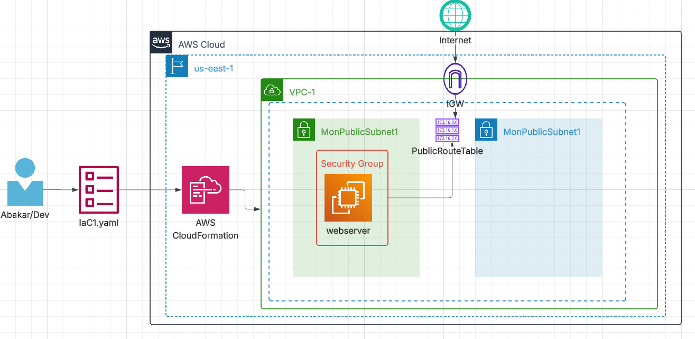

# AWS Infrastructure as Code (IaC) — CloudFormation Project

# 📘 Overview

This project demonstrates how to build and deploy AWS infrastructure automatically using CloudFormation (Infrastructure as Code – IaC).
It provisions both network and application layers, delivering a complete, reproducible, and scalable environment.

Infrastructure as Code (IaC) allows you to:

🚀 Automate AWS resource creation (no manual console setup)

🔁 Reproduce the same infrastructure consistently

🧩 Version control your infrastructure with Git

💰 Avoid misconfiguration and reduce deployment errors

With IaC, your cloud environment becomes code, which means you can:

Deploy, modify, and delete entire architectures in minutes — with one command.

🧩 Architecture Summary

# 1️⃣ Network Layer

VPC – 10.0.0.0/16

Public Subnet – 10.0.0.0/24

Private Subnet – 10.0.1.0/24

Internet Gateway (IGW) – attached to the VPC

Public Route Table – routes 0.0.0.0/0 traffic to the IGW

Subnet Association – connects the public subnet to the route table

# 2️⃣ Application Layer

Security Group:

Inbound rules for HTTP (80) and SSH (22)

EC2 Instance:

Type: t3.micro (Free Tier eligible)

OS: Amazon Linux 2

Located in the public subnet

Uses UserData script to install Apache HTTP server

Hosts a simple HTML page confirming deployment success

# Using AWS Console

Go to AWS CloudFormation → Create Stack

Choose “Upload a template file” → select template.yaml.

Click Next, give your stack a name (e.g., MyInfraStack).

Keep default parameters → Next → Next → Submit.

Wait until the status shows CREATE_COMPLETE.

Check Outputs for:

InstancePublicIP

WebURL → open it in your browser
